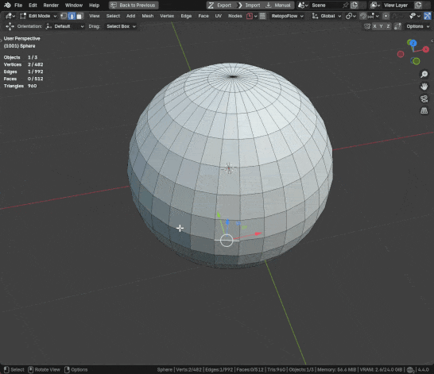

# FlorOps
A collection of operators that I wanted to make to speed up my workflow

## Cycle Items
A better version of Select Next/Previous, instead of using numpad +/- to grow/shrink your selection you can use your mouse wheel.
On top of that you also have access to symmetry and selecting an entire edge ring after confirmation. 
** Currently you can find it in the hotkey Ctrl + Shift + X (this is subject to change)**

### Mirroring

### Edge Rings

## Blend Normals
First select the source mesh, and then shift select your target mesh, then you have two locations to choose from, the easiest one you can find it in your hotkey Ctrl+L

Alternatively you can also find it under your Properterties tab > Data > Vertex Groups, then click the down arrow and select it in the FlOps menu

[Todo list](Todo.md)!
...