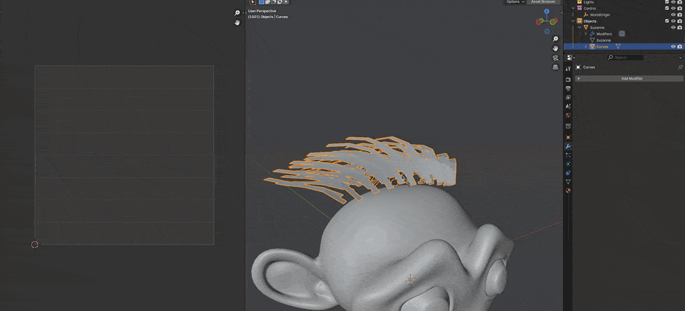

# FlorOps
A collection of operators that I wanted to make to speed up my workflow.

You can download the addon [here.](https://github.com/Floreum/FlOps/releases)

## Cycle Items
A better version of Select Next/Previous, instead of using numpad +/- to grow/shrink your selection you can use your mouse wheel.
On top of that you also have access to symmetry and selecting an entire edge ring after confirmation. 

** Currently you can find it in the hotkey Ctrl + Shift + X (this is subject to change)**

### Mirroring

### Edge Rings

## Blend Normals
First select the source mesh, and then shift select your target mesh, then you have two locations to choose from, the easiest one you can find it in your hotkey Ctrl+L

https://github.com/user-attachments/assets/e4eadd40-430c-4c2e-a6c2-8c44b3b000c6

Alternatively you can also find it under your Properterties tab > Data > Vertex Groups, then click the down arrow and select it in the FlOps menu

As of Blender 4.5 this will now use a Geometry Node version

## Shrinkwrap to Selected
If you've ever made edits to a character mesh, sometimes you need a way to easily fit polygon hairs back onto the head. With this you can go into edit mode and select the roots, then back in object mode select the source then target mesh, then select "Shrinkwrap to Selected". In the future I'll add a  way to offset to the operator box to adjust the offset and an auto apply for the modifier.

** Currently you can find it in the hotkey Ctrl + Shift + X (this is subject to change)**

## Sync Visibility
Sometimes you just can't figure out what is appearing in a final render and don't remember what the object is called or where it got burried.
That's where Sync Visibility comes in handy, just navigate over to your Outliner and press the sync eye icon in the upper right side and click one of two options. You can always undo if you mssed up, but I would recommend you save before you do this.

https://github.com/user-attachments/assets/eebe14e1-411d-4dcc-95ec-838c47f478bc

...

[Todo list](Todo.md)!
...
