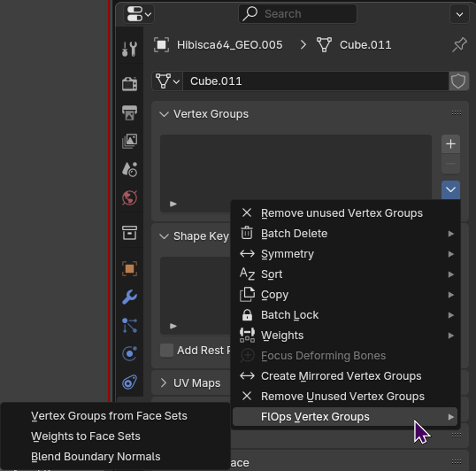

# FlorOps

## Blend Normals
First select the source mesh, and then shift select your target mesh, then you have two locations to choose from, the easiest one you can find it in your hotkey Ctrl+L

Alternatively you can also find it under your Properterties tab > Data > Vertex Groups, then click the down arrow and select it in the FlOps menu

[Todo list](http://10.0.0.227:3000/floreum/FastOps/src/branch/split_operators/Todo.md)!
...